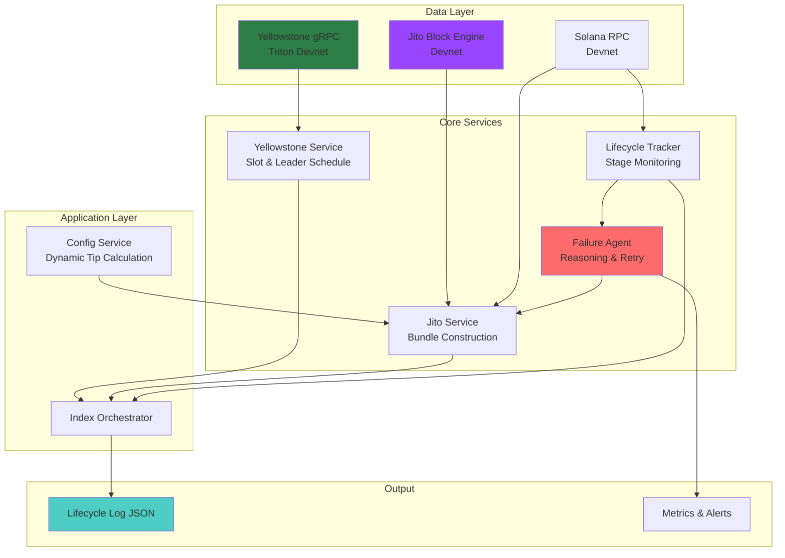
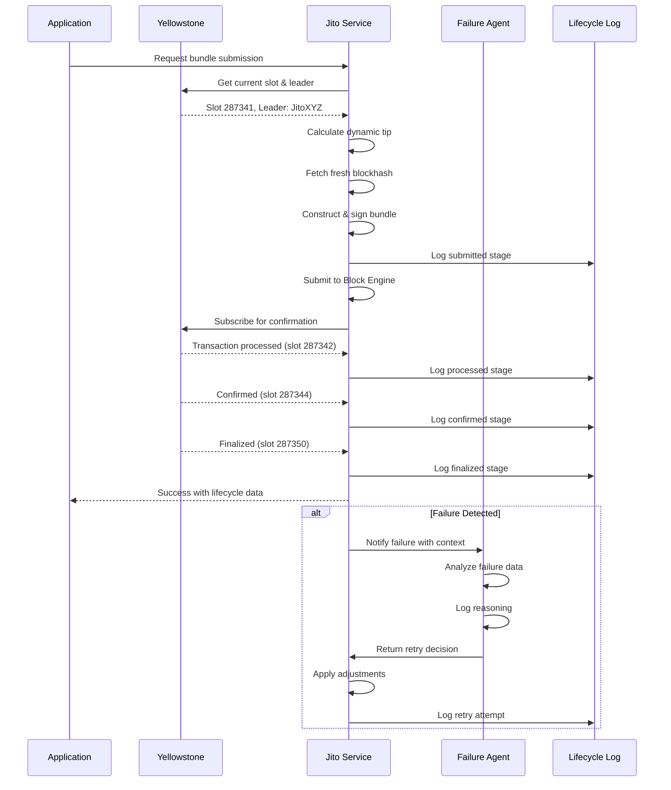
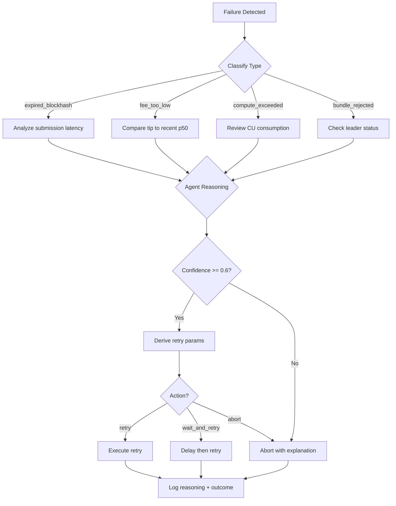

# Solana Transaction Stack Architecture

## System Overview

A production-grade Solana transaction submission pipeline integrating Yellowstone gRPC for real-time slot tracking, Jito Labs for MEV-protected bundle submission, and an AI-powered Failure Reasoning Agent for adaptive retry logic.



## Component Responsibilities

### 1. Yellowstone gRPC Service (`yellowstone.ts`)

**Purpose**: Real-time blockchain state streaming without polling.

**Key Features**:
- Connection to Triton's devnet gRPC endpoint (`mainnet.rpc.jito.wtf` for prod, devnet equivalent for testing)
- Slot subscription with exponential backoff reconnection
- Leader schedule caching for upcoming slot predictions
- Backpressure handling via high-water-mark queue management
- Primary confirmation source — no RPC polling fallback

**Data Flow**:
```
gRPC Stream → Slot Events → Leader Schedule Cache → Backpressure Queue → Subscribers
```

**Reconnection Strategy**:
```
Attempt 1: Immediate
Attempt 2: 1s delay
Attempt 3: 2s delay
Attempt 4: 4s delay
Attempt 5+: 8s delay (capped)
```

### 2. Jito Bundle Service (`jito.ts`)

**Purpose**: Construct and submit MEV-protected bundles with dynamic tipping.

**Key Features**:
- Official `@jito-labs/jito-ts` SDK only
- Dynamic tip calculation from real tip distribution program data
- Tip factors: recent landed tips (p95), slot congestion, leader quality score
- Zero hardcoded tip values — all derived from on-chain data

**Tip Calculation Formula**:
```typescript
baseTip = p95(recent_landed_tips_last_50_bundles)
congestionMultiplier = 1.0 + (skipRate * 0.5)
leaderQualityFactor = leaderHistory[leaderId]?.successRate || 1.0
finalTip = baseTip * congestionMultiplier * leaderQualityFactor
```

**Bundle Lifecycle**:
```
Construction → Sign → Submit → Track → Confirm/Fail
```

### 3. Lifecycle Tracker (`lifecycle.ts`)

**Purpose**: Track bundle progression through confirmation stages.

**Stages**:
| Stage | Trigger | Metrics |
|-------|---------|---------|
| `submitted` | Bundle accepted by Block Engine | timestamp, slot |
| `processed` | Transaction executed in block | timestamp, slot, latency_ms |
| `confirmed` | 32 slots deep (confirmed commitment) | timestamp, slot, latency_ms |
| `finalized` | 31+ confirmations (finalized commitment) | timestamp, slot, latency_ms |

**Failure Classification**:
| Type | Detection | Agent Input |
|------|-----------|-------------|
| `expired_blockhash` | Blockhash age > 150 slots at submission | submission_latency, slot_skips |
| `fee_too_low` | Bundle landed with tip < p50 of recent | tip_percentile, congestion |
| `compute_exceeded` | ComputeUnitLimit exceeded | cu_consumed, cu_limit |
| `bundle_rejected` | Block Engine rejection | rejection_reason, leader_status |

### 4. Failure Reasoning Agent (`ai-agent.ts`)

**Purpose**: Observe failures, reason about causes, derive retry parameters from data.

**Input Data**:
```typescript
interface FailureContext {
  failureType: FailureType;
  failureStage: BundleStage;
  submissionSlot: number;
  submissionTimestamp: number;
  slotConditions: {
    skipRate: number;      // % of slots skipped in last 20
    congestionLevel: number; // from tip distribution
    leaderQuality: number;   // historical success rate
  };
  recentTips: number[];     // last 10 successful bundle tips
  blockhashAge: number;     // slots since blockhash fetch
}
```

**Reasoning Process**:
1. **Observe**: Classify failure type and stage
2. **Analyze**: Correlate with slot conditions and historical data
3. **Confidence**: Score certainty (0-1) based on signal clarity
4. **Decide**: Action (retry/abort/wait), tip adjustment, delay, blockhash refresh
5. **Log**: Full reasoning before any retry action

**Decision Matrix**:
| Failure Type | Typical Action | Tip Adjustment | Delay Logic |
|--------------|----------------|----------------|-------------|
| `expired_blockhash` | retry + refresh | +15-25% | 2 slot windows |
| `fee_too_low` | retry | +30-50% | Immediate |
| `compute_exceeded` | retry | 0% | After CU analysis |
| `bundle_rejected` | wait_and_retry | +10-20% | Next leader slot |

**Agent Constraints**:
- ❌ NO hardcoded retry counts
- ❌ NO fixed tip percentages
- ❌ NO fixed delays
- ❌ NO retry without logged reasoning
- ❌ NO abort without explanation

### 5. Config Service (`config.ts`)

**Purpose**: Centralized configuration with environment overrides.

**Environment Variables**:
```bash
# Yellowstone gRPC
YELLOWSTONE_RPC_URL=mainnet.rpc.jito.wtf
YELLOWSTONE_AUTH_TOKEN=<token>

# Jito Block Engine
JITO_BLOCK_ENGINE_URL=mainnet.block-engine.jito.wtf
JITO_AUTH_KEYPAIR_PATH=~/.config/solana/id.json

# Solana RPC
SOLANA_RPC_URL=https://api.devnet.solana.com
SOLANA_COMMITMENT=confirmed

# Agent Settings
AGENT_MAX_RETRIES=3
AGENT_MIN_CONFIDENCE=0.6
```

## Data Flow Sequence



## Failure Handling Flow



## Security Considerations

1. **Key Management**: Jito auth keypair stored encrypted, loaded from secure path
2. **Rate Limiting**: Exponential backoff on all external calls
3. **Input Validation**: All on-chain data validated before use in tip calculation
4. **Error Boundaries**: Every external call wrapped with try/catch and structured error logging

## Observability

- **Lifecycle Log**: JSON append-only log of all bundle submissions
- **Reasoning Logs**: Structured agent decisions with confidence scores
- **Metrics**: Tip amounts, latency percentiles, failure rates by type

## Deployment Topology

```
┌─────────────────────────────────────────────────────┐
│                    Gensee Crate VM                   │
│  ┌───────────┐  ┌───────────┐  ┌─────────────────┐  │
│  │Yellowstone│  │   Jito    │  │  Failure Agent  │  │
│  │  Service  │  │  Service  │  │     (AI)        │  │
│  └─────┬─────┘  └─────┬─────┘  └────────┬────────┘  │
│        │              │                 │           │
│        └──────────────┴─────────────────┘           │
│                           │                         │
│                    ┌──────▼──────┐                  │
│                    │ Orchestrator│                  │
│                    │   (index)   │                  │
│                    └──────┬──────┘                  │
└───────────────────────────┼─────────────────────────┘
                            │
         ┌──────────────────┼──────────────────┐
         │                  │                  │
   ┌─────▼─────┐    ┌──────▼──────┐   ┌───────▼───────┐
   │ Yellowstone│    │   Jito BE   │   │  Solana RPC   │
   │   gRPC     │    │  (Devnet)   │   │   (Devnet)    │
   └───────────┘    └─────────────┘   └───────────────┘
```

## Performance Targets

| Metric | Target | Measurement |
|--------|--------|-------------|
| Submission latency | < 200ms p95 | submitted → processed |
| Tip efficiency | > 80% landed | landed / submitted |
| Agent accuracy | > 85% correct | successful retries / total retries |
| Reconnection time | < 5s p99 | disconnect → reconnect |
| Backpressure | 0 dropped events | queue high-water-mark |

---

*Architecture v1.0 — Production Solana Transaction Stack*
